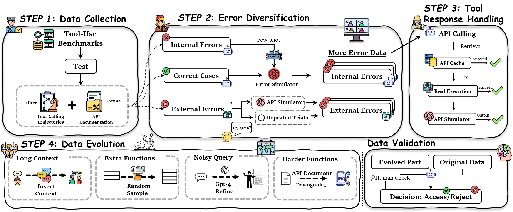

<h3 align="center"><a href="" style="color:#9C276A">
CRITICTOOL: Evaluating Self-Critique Capabilities of Large Language Models in Tool-Calling Error Scenarios</a></h3>
<h5 align="center"> 

<h5 align="center">

[](https://arxiv.org/abs/2506.13977) 
[](https://huggingface.co/datasets/chocckaka/CriticTool-Dataset)
[](https://shellorley0513.github.io/CriticTool/)

## 🔍 Introduction

Official Implement of "CRITICTOOL: Evaluating Self-Critique Capabilities of Large Language Models in Tool-Calling Error Scenarios"

> The ability of large language models (LLMs) to utilize external tools has enabled them to tackle an increasingly diverse range of tasks. However, as the tasks become more complex and long-horizon, the intricate tool utilization process may trigger various unexpected errors. Therefore, how to effectively handle such errors, including identifying, diagnosing, and recovering from them, has emerged as a key research direction for advancing tool learning. In this work, we first extensively analyze the types of errors encountered during the function-calling process on several competitive tool evaluation benchmarks. Based on it, we introduce CriticTool, a comprehensive critique evaluation benchmark specialized for tool learning. Building upon a novel evolutionary strategy for dataset construction, CriticTool holds diverse tool-use errors with varying complexities, which better reflects real-world scenarios. We conduct extensive experiments on CriticTool, and validate the generalization and effectiveness of our constructed benchmark strategy. We also provide an in-depth analysis of the tool reflection ability on various LLMs, offering a new perspective on the field of tool learning in LLMs.

<div>
<center>

</div>

## 🚀 News
**[2025/6/11]** Paper available on [Arxiv](https://arxiv.org/pdf/2506.13977).🔥🔥🔥

**[2025/6/24]** Release [CriticTool-Dataset](https://huggingface.co/datasets/chocckaka/CriticTool-Dataset).🤗🤗🤗

## 🧾 Todo
[x] Release CriticTool dataset.

[ ] Release CriticTool evaluation code.


## 🖊️ Citation
If you find CriticTool useful for your research and applications, please cite using this BibTeX:
```
@article{huang2025critictool,
  title={CRITICTOOL: Evaluating Self-Critique Capabilities of Large Language Models in Tool-Calling Error Scenarios},
  author={Huang, Shiting and Fang, Zhen and Chen, Zehui and Yuan, Siyu and Ye, Junjie and Zeng, Yu and Chen, Lin and Mao, Qi and Zhao, Feng},
  journal={arXiv preprint arXiv:2506.13977},
  year={2025}
}
```